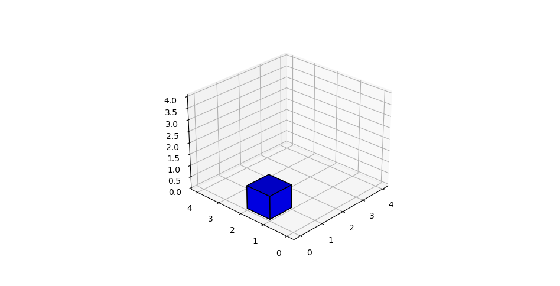
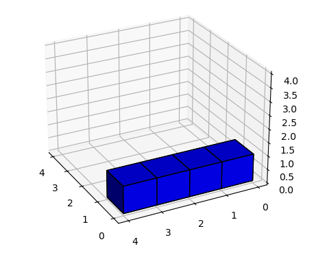

# To be revisited

Ideally, should be as small as possible. 

---

## [169. Majority Element][169]

Solved but `O(N)` space, this basically involves a counter, again. 

Still can't think of what trick would allow us to solve it in `O(N)` with `O(1)` space. Give it a couple of looks on other days and if you can't come up with something
add the `O(N)` time/space complexity option.

## [762. Prime Number of Set bits in binary representation.][762]

Solved but badly. There's a trick here and I can't find it, yet. I do notice there's a slight relation
between the difference and their number but can't find what. So..

## [892. Surface area of 3d shapes.][892]

I can't really understand how exactly some of these cases are handled. For example, the following plots show the 3d layout for the cases:

 1. `[[1, 0, 1], [0, 1]]`
 2. `[[0, 1]]` 
 3. `[[1, 1, 1, 1]]`

These have as a result the values `12, 0, 6` respectively.

	
	
	

I cannot, yet, understand why these values are what they are, I'm not entirely sure how 'surface area' is defined. 

For `1. [[1, 0, 1], [0, 1]]` I count `6 + 6 + 6 = 18` one six for each of the cubes present, I can't see what I shouldn't be counting. (the bottom `3` surfaces the shape is resting on?)
For `2. [[0, 1]]` I, again, count `6`, the same amount as I would count for `[[1, 0]]` or `[[1]].
Finally, for `3. [[1, 1, 1, 1]]` I would count `18`. 

Whatever the case, needs revisiting at some point when I've forgotten about it a bit and I'm able to see it again with fresh eyes.

[169]: https://leetcode.com/problems/majority-element/
[762]: https://leetcode.com/problems/prime-number-of-set-bits-in-binary-representation/
[892]: https://leetcode.com/problems/surface-area-of-3d-shapes/